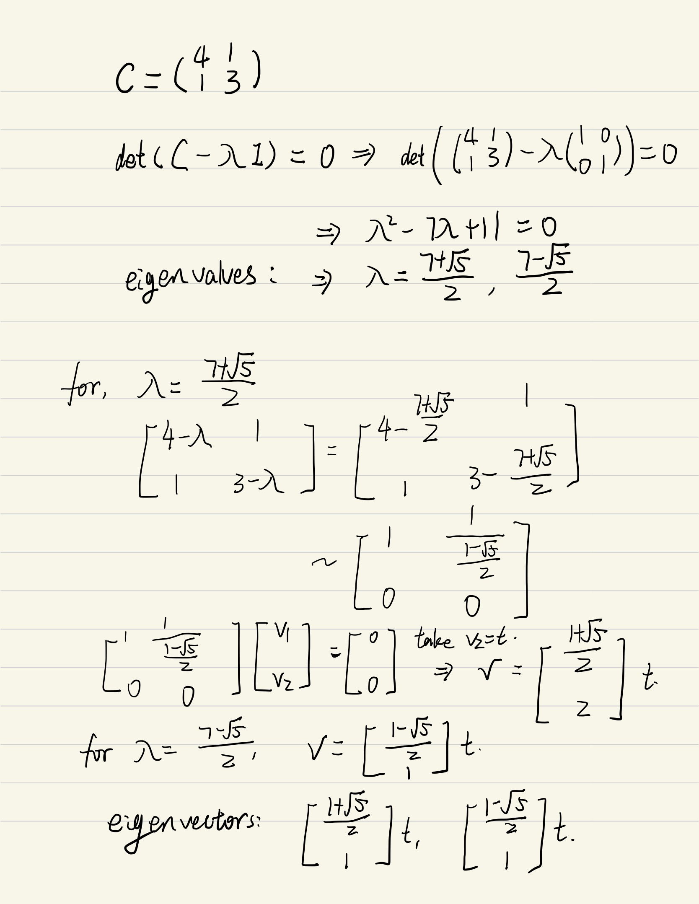
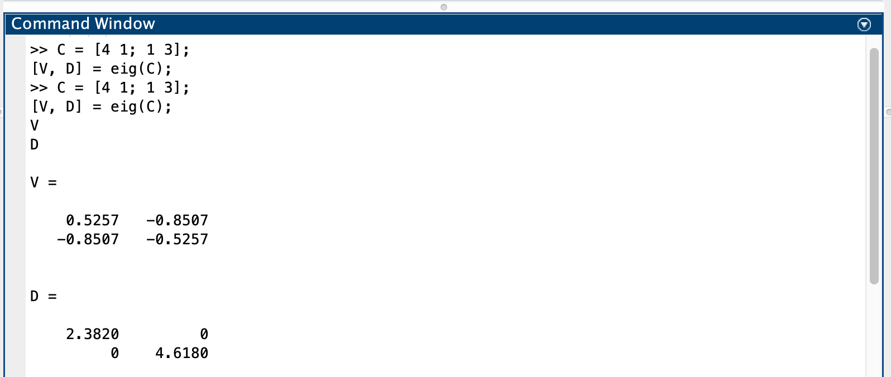
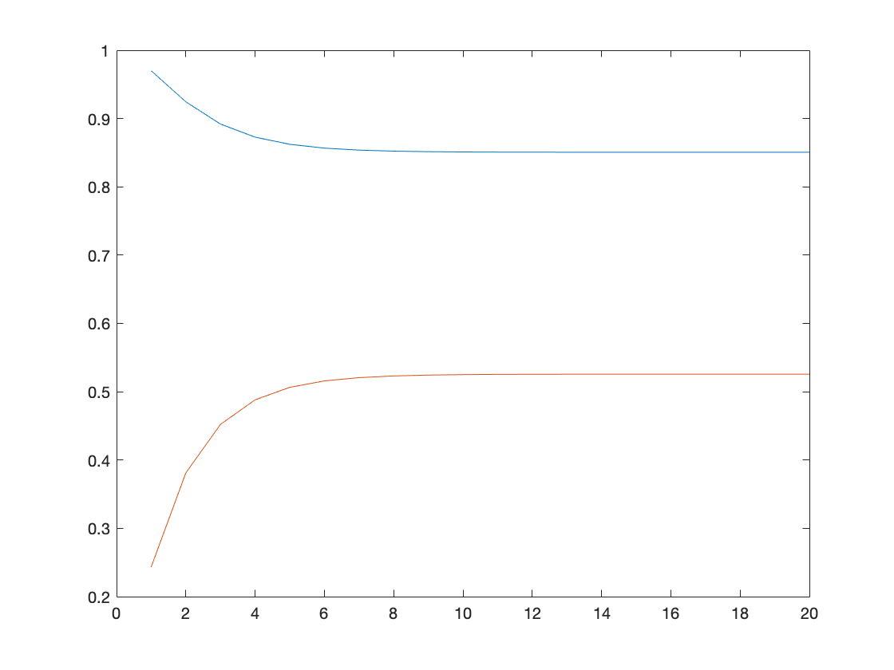
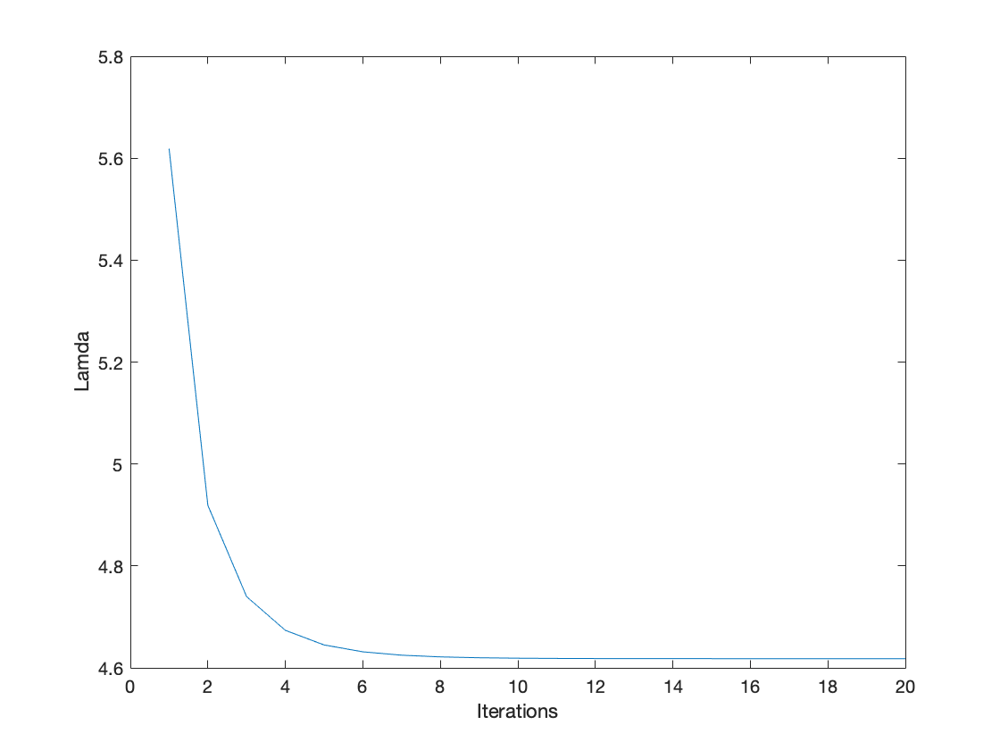

# BSS Lecture Codes
## Reza Sameni
## Emory University Department of Biomedical Informatics

A short lecture of blind-source separation algorithms with practical examples in Matlab

### Student Name: Shaoju Yu
### Student Email: shaojun.yu@emory.edu

### Question 1 
#### Part A

#### Part B

### Question 2 
#### Part A
See code in homework.m
#### Part B

### Question 3 
#### Part A
See changes in .m files

#### Part B
1. Ex01, Total energy is sum of varance of original data; By calculating the variance of PCA transformed data, we can get how much variance explained by the top-N features. The ratio of an eigenvalue to the sum of all eigenvalues is also the percentage of variance explained by the corresponding feature. In the test case, the first two components can explain up to 99.9% variance of the orignal data, which means we can compress the data into 2 dimensions without lossing much information. This can be verified by the plot and there is only tiny difference between the orgianl data and the compressed data.   

2. Ex02, Power iteration is a very simple algorithm, but it may converge slowly. The most time-consuming part of the algorithm is the multiplication of matrix by a vector, so it is effective for a very large sparse matrix with appropriate implementation. With the increasement of interations, the results of power methos becomes more accurate.  

3. Ex03,  In this example, we tested servral algorithms for independent component analysis, including fastica, jade, sobi. Example 2 has 15 channels of data, and all these ICA algorithms can decompose it into 15 channels, but the order of channels is not same as the raw data. These algotithnms can also work properly without specifying the Number of independent components to be estimated.

4. Ex04,  In this example, the orignal has 25 channels, we first use JADE and nonstationary component analysis to extract the sources, then selecte a certain channel of data to remove from the raw data. In term of selecting the nosie channel, we can check from the plots to visually detect the EOG. By checking the chnannel names of raw data, we could find the channel 23,24,25 are eog channels and could remove them.

5. Ex05,  In function testECGICAPCAPiCAPlot1, it’s a unit test to compare various ICA algorithms fot extracting fetal ECG signals, including ICA, PCA and PiCA. They all successfully decompose the signals into 15 different channels. Pseudo-Periodic Component Analysis requires to specify first signal peaks.

### Question 4 
#### Part A
- Summary of A comparison of PCA, KPCA and ICA
for dimensionality reduction in support
vector machine

In this paper, the authors compared three different dimensionality reduction algorithms: PCA, KPCA and ICA. In the machine learinig settings, they were all treated as feature extraction methods for SVM, reducing the high dimensianl data into low dimension inputs for SVM. PCA linearnly transforms the orignal data into new matrix whose componets are uncorrelated and could explain the origanl variance to the maximun extent. KPCA is an algorithm applying kernel method to replace the linear transform into non-linear transform. The kernels (different mapping functions, non-linear mapping) fisrt map origal data into a higher dimension feature sapce, then use PCA on this space to reduce the dimensions. From this process, KPCA can generate more features because of the extended feature space. Independent component analysis was orignally developed to separate unknown source signals from the mixtures and its underlying assumption is that these unknown signals are mutually independent and linearly mixed by different coeLcients. By mutually independent, it means thses signals are statistical independent and the joint probability of any two signals is the product of marginal probability of individual signal. ICA only allows at most one of the source signals is Gaussian. There are different implementations of ICA algorithnms, and fixed-point-FastICA was selected to calculate ICA. The authors choosed three different datasets for experiment: sunspot data, Satan Fe dataset, which are believed to be nonlinear and non-stationary. The performance of four algorithm (SMV, PCA + SVM, KPCA + SVM, ICA + SVM) is measured by the normalized mean square error (NMSE) criterion. The results
show that SVM with feature extraction using PCA, KPCA or ICA can achieve better performance than that without feature extraction. The results also show that KPCA and ICA perform better than PCA on all data sets, with the best performance in KPCA, and the reason lies in the fact that KPCA and ICA can explore higher order information of the original inputs than PCA.

